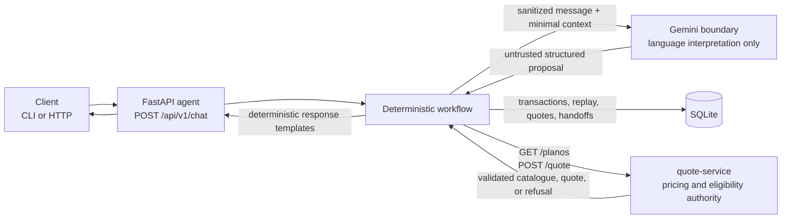

# AutoSeguro conversation agent

AutoSeguro is a production-minded take-home implementation of a conversational vehicle-insurance quoting flow. It is one FastAPI application backed by SQLite and integrated with the supplied, unchanged `quote-service`.

The core safety rule is deterministic ownership: Gemini may interpret Portuguese language, but it cannot calculate or alter prices, approve eligibility, choose retries, persist state, or initiate handoff by itself. Every personalized quote and business refusal comes from `quote-service`.

## Architecture



Gemini has no access to SQLite or `quote-service`. The deterministic workflow validates every model proposal before it can affect conversation fields.

| Responsibility | Owner |
| --- | --- |
| Interpret Portuguese intent and propose candidate fields | Gemini adapter |
| Normalize and validate fields, clarify ambiguity, transition state | Deterministic application code |
| Retry classification, deadlines, quote reuse, handoff policy | Deterministic application code |
| Idempotency, transactions, recovery, retention | Deterministic application code and SQLite |
| Customer-visible financial and business wording | Deterministic templates populated from validated results |
| Premium, deductible, eligibility, coverage, waiting periods, proration | Supplied `quote-service` |

The application contains no copied rating algorithm and never turns catalogue base prices into personalized estimates.

## Request lifecycle

1. Atomically claim `(conversation_id, message_id)` before external work.
2. Load structured conversation state; raw transcripts are not retained.
3. Sanitize the current message, keeping CEP locally as structured state.
4. Fetch and validate the current plan catalogue, then request a schema-constrained language proposal.
5. Deterministically ground candidate values in the message, merge corrections, and clarify missing or ambiguous fields.
6. Reuse an eligible recent quote or request a new calculation from `quote-service`.
7. Validate the upstream result and render it with deterministic templates.
8. Commit conversation state, quote or handoff, and the replayable response in one transaction.

A complete, unambiguous request quotes immediately. Required pricing inputs are `plano_id`, `idade`, and `veiculo_ano`. `cep` and `data_inicio` are optional upstream, but the conversation asks about them until the user supplies a value or explicitly answers `sem CEP` / `sem data`.

## Run with Docker

Docker Compose is the only prerequisite for the offline demonstration.

```sh
cp config/development.env.example .env.development
docker compose --env-file .env.development up --build -d

curl http://127.0.0.1:8080/health
curl http://127.0.0.1:8080/ready
```

Development uses the labelled fake Portuguese extraction adapter and preserves the supplied service's default 20% failure and 10% slow-response simulation. For a deterministic successful demonstration, apply the test override:

```sh
docker compose \
  --env-file .env.development \
  -f docker-compose.yml \
  -f compose.test.yml \
  up --build -d
```

Only the agent is exposed, on `127.0.0.1:8080`; `quote-service` remains on the internal Compose network. Both containers run as UID/GID 10001, use UTC, and the agent stores SQLite in the `agent-data` named volume.

Run one agent instance with one worker and a local filesystem. `docker compose down` preserves the named volume unless it is explicitly removed.

## API

| Method | Route | Purpose |
| --- | --- | --- |
| `POST` | `/api/v1/chat` | Submit one idempotent conversation turn |
| `GET` | `/health` | Process liveness, application version, Git SHA |
| `GET` | `/ready` | Durable-storage initialization and writeability |

### Submit a chat turn

Both IDs are required client-generated UUIDs, including for the first message. Messages must contain 1–4,000 characters.

```sh
curl --request POST http://127.0.0.1:8080/api/v1/chat \
  --header 'Content-Type: application/json' \
  --header 'X-Correlation-ID: 93470aef-bf2d-4275-b7a3-33b33d42efe4' \
  --data '{
    "conversation_id": "f6e6d08b-7b96-4367-a697-0728af02a969",
    "message_id": "cb91cd7e-9262-474b-a9ee-a6f8012ec123",
    "message": "Quero completo, tenho 35 anos, modelo 2024, sem CEP, sem data."
  }'
```

`X-Correlation-ID` is optional. A valid UUID is accepted; any other value is replaced with a generated UUID. The response header identifies the current HTTP request.

A successful chat response includes `conversation_id`, `message_id`, `correlation_id`, `status`, and `reply`, plus nullable `quote` and `handoff` objects.

| Status | Meaning |
| --- | --- |
| `collecting` | More information is required, or the language provider is temporarily degraded |
| `quoted` | A validated quote was returned or reused |
| `rejected` | `quote-service` returned a validated business refusal |
| `handoff_pending` | A durable handoff exists for the conversation |

See the actual container-generated [successful response](evidence/success-dialogue.json) and [failure response](evidence/failure-dialogue.json).

For a correction or fresh calculation, retain `conversation_id` and use a new `message_id`. Examples include `tenho 36 anos`, `premium`, `CEP 07100-100`, `inicio 2026-09-15`, and `nova cotacao`.

## CLI and local development

Python 3.12–3.14 and uv 0.8.22 are supported. CI and the application container use Python 3.12. Install uv 0.8.22 using an [official method for your platform](https://docs.astral.sh/uv/getting-started/installation/), such as a standalone installer, package manager, or release binary, then confirm the installed version with `uv --version`.

```sh
uv sync --project agent-service --frozen

cd agent-service
export HMAC_SECRET=development-only-0123456789abcdef
export QUOTE_URL=http://127.0.0.1:8000
uv run --frozen python -m agent_service
```

For local non-container execution, start the supplied service separately with `TZ=UTC`:

```sh
cd quote-service
TZ=UTC uv run uvicorn app.main:app --port 8000
```

The chat CLI writes opaque IDs to `.chat-ids.json` with mode `0600` before network work. It does not save the message.

```sh
cd agent-service
uv run --frozen python -m agent_service.cli chat \
  --new-conversation \
  --message 'Quero completo, tenho 35 anos, modelo 2024, sem CEP, sem data.'

uv run --frozen python -m agent_service.cli chat --message 'tenho 36 anos'

# Retry only after a lost HTTP response, using the identical message and saved IDs.
uv run --frozen python -m agent_service.cli chat \
  --retry \
  --message 'tenho 36 anos'
```

Operational commands for the Compose deployment:

```sh
docker compose --env-file .env.development exec agent \
  python -m agent_service.cli handoffs list

docker compose --env-file .env.development exec agent \
  python -m agent_service.cli retention
```

`handoffs list` opens SQLite read-only and returns only the handoff ID, opaque conversation ID, safe reason code, and creation time.

## Reliability and failure handling

### Quote-service boundary

The HTTP client is shared, disables transport retries and redirects, uses explicit connection limits, and applies the following deterministic policy itself:

| Result | Action |
| --- | --- |
| Connection/reset, read/write/protocol error, timeout | Retry within the attempt and shared-deadline limits |
| HTTP `5xx` | Retry within the same limits |
| Valid `422 cotacao_recusada` | Do not retry; return a deterministic refusal explanation |
| Valid correctable `400/422` field error | Do not retry; clarify only the identified field |
| Other `4xx`, TLS/configuration failure, or redirect | Do not retry; create a safe technical handoff |
| Malformed JSON or invalid success/refusal schema | Do not retry; create a contract-error handoff without displaying a price |
| Attempts or shared deadline exhausted | Create a durable `dependency_unavailable` handoff |

Defaults are at most three attempts including the first, two seconds per attempt, a 0.5-second connect timeout, and full-jitter backoff capped at 200 ms then 400 ms. Catalogue lookup, language extraction, quote attempts, and sleeps share a 39-second decision budget.

Retrying `POST /quote` is safe only because the supplied service performs a side-effect-free calculation. This policy must not be generalized to an upstream that creates quotes, policies, or payments without its own idempotency contract.

### Gemini boundary

Gemini receives no automatic retry. Rate limits, provider timeouts, `5xx`, transport errors, safety blocks, malformed output, invalid schema, and ungrounded candidates are safely audited and return the existing temporary degraded response. They do not increment user clarification attempts or independently create a handoff. A new message ID is required to attempt the provider again; exact replay of the original message ID returns its saved degraded response.

User-owned failure paths remain separate:

- Missing, conflicting, or ambiguous fields produce one focused deterministic question.
- Two unsuccessful clarification attempts for the same unresolved issue create a handoff.
- Repeated unsupported media markers create a handoff; the application does not transcribe attachments.
- An explicit request for a person creates a handoff from any state.
- Requests requiring business authority, such as discounts or issuance, create a handoff.

Once a conversation reaches `handoff_pending`, later messages return the existing handoff reference and do not resume automatic quoting.

### Nested deadlines and storage failures

The three deadlines are nested, not additive:

| Scope | Default | Effect |
| --- | --- | --- |
| Gemini provider call | 30s | Adapter ceiling, nested inside the quote-decision and workflow budgets |
| Quote decision | 39s | Starts before catalogue lookup and is shared by lookup, Gemini extraction, quote attempts, and backoff sleeps |
| Chat turn | 40s | Outer API budget; 39s is available to the workflow and 1s is reserved for finalization |

These timers run concurrently rather than adding together. With the defaults, the bounded catalogue phase leaves enough of both enclosing 39-second windows for Gemini's 30-second provider deadline to be effective. Quote attempts after extraction use whatever decision time remains. The existing limit of three attempts, two-second per-attempt timeout, and backoff policy is unchanged.

An overall turn cancellation or process interruption becomes one durable `processing_interrupted` handoff. If final persistence fails, the API returns a safe `503`, marks the instance unready, and never claims that a quote or handoff was committed.

## Idempotency and state

SQLite uses foreign keys, WAL mode, a 250 ms busy timeout, schema version `1`, and explicit short transactions. Network calls occur outside database transactions.

| Table | Stored data |
| --- | --- |
| `conversations` | Workflow status and normalized structured context |
| `messages` | HMAC fingerprint, processing state, correlation ID, saved response |
| `quotes` | Input fingerprint/snapshot, catalogue fingerprint, service date, validated result, expiry |
| `handoffs` | One safe handoff per conversation with structured context |

Message behavior is scoped to `(conversation_id, message_id)`:

| Condition | Result |
| --- | --- |
| Same IDs and same content, completed | Return the exact saved response without external work |
| Same IDs with different content | `409 idempotency_conflict` |
| Same message still processing | `409 message_in_progress` |
| Different message while the conversation is processing | `409 conversation_busy` |

Request content is fingerprinted with HMAC-SHA256 using the stable `HMAC_SECRET`; the fingerprint is not logged. Startup recovery converts abandoned processing messages into saved `processing_interrupted` outcomes before readiness.

Successful quotes are reusable for five minutes only when the conversation, normalized pricing inputs, validated catalogue fingerprint, and UTC service date are identical. Corrections, expiry, catalogue changes, date rollover, or `nova cotacao` bypass reuse. Rejections and technical failures are not cached as successful quotes. Exact message replay remains historical after quote expiry.

The retention command deletes inactive conversations and dependent rows after 30 days by default, excluding active processing turns. Idempotency guarantees end when records are deleted; callers must not reuse expired IDs.

## Privacy, PII, and logging

Before Gemini is called, the application removes common CPF, phone, email, plate, name, and URL patterns. CEP is extracted locally and replaced with a presence marker; only the sanitized current message, minimal structured context, last question ID, and current catalogue choices cross the provider boundary.

Redaction is deliberately treated as imperfect. Free text may contain identifiers outside known patterns, so the deployment still requires an appropriate provider data policy and restricted local storage.

The application does not persist raw messages, prompts, or model output. Structured conversation fields, quotes, saved replies, and handoff context can still contain personal data. Restrict the SQLite volume and backups, and apply the retention command appropriate to the deployment.

Operational logs use an explicit metadata allowlist and exclude messages, prompts, provider/upstream bodies, quote fields, personal fields, arbitrary exceptions, credentials, headers, client IPs, and HMAC fingerprints. Uvicorn access logging and provider/HTTP debug logging are disabled.

SQLite files, environment files, credentials, local chat IDs, raw provider output, and private exports are excluded from Git.

## Gemini provider behavior

Production supports one provider: Gemini's stateless `generateContent` API. The default model is `gemini-3.8-flash`; prompt revision is fixed at `extract-v1`.

The request uses:

- `store=false`;
- structured JSON output through the narrow `Proposal` schema;
- no tools, grounding, files, cached content, or conversation history;
- no SDK or transport retry layer.

The model can propose only intent, candidate field/value/evidence triples, ambiguity markers, and a refresh flag. Application code validates and grounds those proposals. Model intent cannot initiate handoff, model refresh cannot bypass quote reuse, and extra fields such as a model-supplied price fail schema validation.

Provider failures are recorded with safe category and HTTP-status metadata; prompts, response bodies, user messages, and exception text are excluded.

`store=false` is not a guarantee of zero provider retention. Review Google's current [logs and datasets](https://ai.google.dev/gemini-api/docs/logs-datasets), [Zero Data Retention](https://ai.google.dev/gemini-api/docs/zdr), and [structured output](https://ai.google.dev/gemini-api/docs/structured-output) documentation for the project in use.

### Production configuration

```sh
cp config/production.env.example .env.production
# Replace PROVIDER_SECRET and HMAC_SECRET with distinct real secrets.
# Stop development first if it occupies port 8080.
docker compose --env-file .env.production -p agent-production up --build -d
```

Production startup rejects the fake adapter, missing provider credentials, and obvious placeholder secrets. There is no silent fallback to fake behavior.

| Setting | Default / constraint |
| --- | --- |
| `APP_ENV` | `development`; allowed: `development`, `production` |
| `LANGUAGE_PROVIDER` | `fake`; production requires `gemini` |
| `LANGUAGE_MODEL` | `gemini-3.8-flash` |
| `PROVIDER_SECRET` | Required for Gemini |
| `HMAC_SECRET` | Required; at least 32 characters and stable for replay |
| `QUOTE_URL` | `http://127.0.0.1:8000` outside Compose |
| `SQLITE_PATH` | `data/agent.sqlite3` outside Compose |
| `MAX_ATTEMPTS` | `3`, maximum `3` |
| `ATTEMPT_TIMEOUT` / `CONNECT_TIMEOUT` | `2s` / `0.5s` |
| `QUOTE_DEADLINE` / `LLM_DEADLINE` / `TURN_DEADLINE` | `39s` / `30s` / `40s` |
| `FINALIZATION_RESERVE` | `1s` |
| `QUOTE_TTL` / `RETENTION_DAYS` | `300s` / `30 days` |
| `APP_VERSION` / `GIT_SHA` | `1.0.0` / `unknown` |

The deployment contract is loopback/private networking. Internet exposure requires an access boundary outside this repository.

## Testing, CI, and evidence

Required checks use the fake adapter and require no provider credentials. Integration tests start the actual supplied `quote-service` with failure and slow rates set to zero. Controlled HTTP stubs cover retry counts, deadlines, malformed responses, and deterministic status classification.

```sh
uv sync --project agent-service --frozen
uv run --project agent-service --frozen \
  ruff check agent-service scripts/container-smoke.py scripts/evaluate.py
uv run --project agent-service --frozen \
  ruff format --check agent-service scripts/container-smoke.py scripts/evaluate.py
(cd agent-service && TZ=UTC uv run --frozen python -m pytest -q)
uv run --project agent-service --frozen \
  python scripts/evaluate.py --output evidence
docker compose --env-file config/development.env.example build
python3 scripts/container-smoke.py --output evidence
python3 scripts/container-smoke.py --failure --output evidence
```

Stop any deployment bound to port 8080 before running the smoke tests. They use the separate `agent-acceptance` Compose project, rebuild both images, verify health/readiness, exercise success or deterministic quote-service exhaustion, restart the agent, and assert exact durable replay. Acceptance containers are removed afterward; their named test volume is preserved.

[GitHub Actions](.github/workflows/ci.yml) runs frozen dependency installation, lint/format checks, unit and real-service integration tests, offline evaluation, both image builds, and both container smoke paths on Python 3.12.

Evidence is separated by purpose:

| Artifact | Contents |
| --- | --- |
| [Evidence guide](evidence/README.md) | Provenance and regeneration notes |
| [Success dialogue](evidence/success-dialogue.json) | Actual synthetic request and quoted container response |
| [Success events](evidence/success-events.jsonl) | Correlated allowlisted operational events |
| [Failure dialogue](evidence/failure-dialogue.json) | Three exhausted quote attempts followed by durable handoff |
| [Failure events](evidence/failure-events.jsonl) | Correlated allowlisted failure events |
| [Extraction sample](evidence/extraction-sample.json) | 20 de-identified dataset messages plus five supplemental cases |
| [Extraction evaluation](evidence/extraction-evaluation.json) | Offline fake-adapter results; not live-model quality |
| [Validation results](evidence/validation.md) | Current local validation results and environment notes |
| [Live production config](evidence/live-production-config.json) | Sanitized production runtime configuration using Gemini |
| [Live production response](evidence/live-production-response.json) | Successful live Gemini end-to-end quote |
| [Live production events](evidence/live-production-agent.log) | Production logs showing retry recovery, quote completion, and exact replay |

Optional live evaluation sends the same de-identified cases to the configured Gemini project and may incur charges:

```sh
uv run --project agent-service --frozen python scripts/evaluate.py --live
```

It attempts all 25 cases, reports provider availability separately from extraction quality, exits `2` when provider failures occurred, and exits `1` for extraction failures without provider failures.

## Limitations

- One application instance and one SQLite writer are supported; there is no distributed coordination.
- There is no frontend, WhatsApp integration, user account system, RBAC, or public handoff API.
- Handoffs are durable local records only. There is no notification, assignment, resolution workflow, response-time promise, or automatic return to the bot.
- The application calculates no policy issuance, payment, binding coverage, or active insurance.
- Quote reuse is a five-minute application policy, not a guarantee of a binding offer or upstream price-version contract.
- Local replay is durable, but exactly-once external execution is not guaranteed if the process dies after a quote calculation and before commit. The supplied quote calculation has no side effects.
- PII redaction is pattern-based and cannot guarantee removal of every identifier.
- Live-provider quality and availability are not part of required CI; the offline adapter evaluation is intentionally limited.
- The supplied `quote-service` remains immutable challenge infrastructure, including its original packaging choices.

## AI-assisted development logs

[ai-logs/](ai-logs/) contains the available sanitized planning and implementation conversation exports plus their provenance and limitations. These are conversation-only snapshots, not raw complete tool sessions. No unavailable conversation was fabricated.

AI logs were reviewed and sanitized before publication. Credentials, personal information, and private exports are excluded.

## Design reference

[PLANNING.md](PLANNING.md) records the architecture, invariants, failure policy, and acceptance rationale used to build this implementation.
